# Overview 

Makernet is a general-purpose modular framework for making interactive electronics projects. Makernet radically simplifies the work of connecting and coding for projects that that are made up of different devices such as displays, keyboards, knobs, switches, LED strips, sound playing devices, etc. It aims to bring 21st-century concepts of clean abstraction and modularity to hardware design.

Makernet is in active development. I am looking for manufacturing, business and technical partners.

An early demonstration video here:

[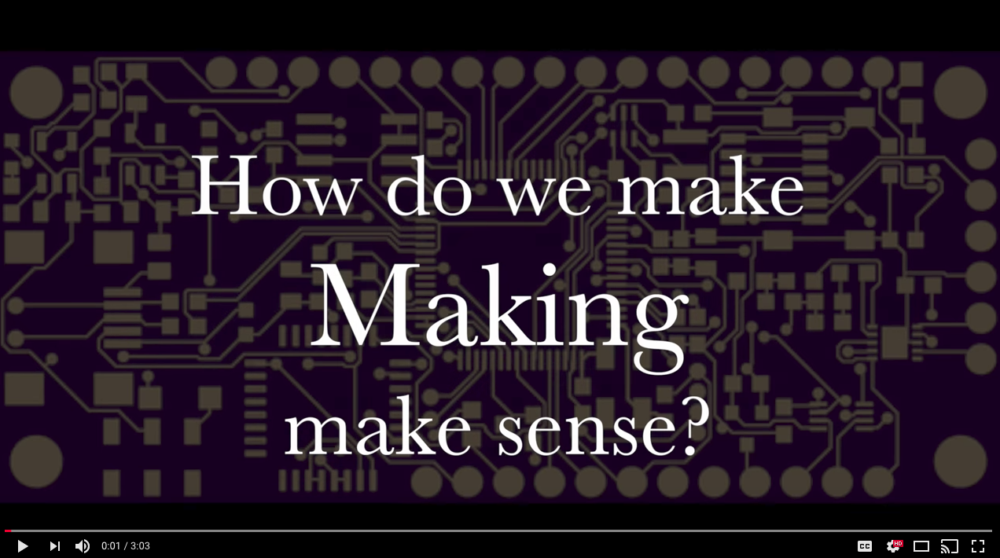](https://www.youtube.com/watch?v=rZLKJq-t7fU)

With Makernet, designing interactive projects is less painful, more fun, and way more flexible. Makernet devices designed today include:

Makernet is comprised of several elements:

- A common network or field-bus (loosely based on I2C) that daisy-chains all project components with a 6-pin connector providing data, power and ground
- A network framework that supports dynamic addresses, device discovery, introspection, message passing for highly memory/processor constrained devices
- A high quality object-oriented software framework that allows the project designer to remain focused functionality, not intricate hardware details
- A set of existing hardware designs implementing a variety of peripheral types such as knobs, buttons, sounds, displays, capacitive touch, etc.
- A easy-to-use extension framework for creating new peripherals

The framework requires no soldering, is 100% Arduino compatible, and supports low-power applications. It has been shown to work on the Teensy 3.1/3.2, Adafruit Feather M0, and likely works with any SAMD21-based board such a Arduino Zero. The design supports hot-plugging (devices can enter or leave the network without disruption to running programs). Due to its flexible architecture and strong abstraction around the physical layer, Makernet can be adapted for wireless and RS485 protocols.

Makernet is aimed at artists, educators, students, hobbyists and prototypers. The aim is to democratize the creation of cool hardware and software, and make hardware work in a more clean, 21st century fashion. Because it is expandable and new designs can be added over time, Makernet is intended to seed an expanding ecosystem of compatible components and software.

You might think that the extra complexity of a network layer adds unnecessary expense to a new project. However, the reality is that the prices of high-speed 32-bit ARM processors have fallen so low that the extra expense is negligible especially for prototyping and limited-run projects. Makernet compatibility adds less than $2.00 to the BOM of its peripherals in _single_ quantities, requiring nothing more than a commodity JST-SH connector and a $1.18 ATSAMD11 processor (plus a few passives like decoupling capacitors.) Peripherals do not need an external clock or any transceivers. 

# Planned devices

- Knobs (rotary encoder) - DONE (GM1200)
- Polyphonic playback using a SD card and speaker - WORKNG PROTOTYPE
- SSD1306 displays - DONE
- LCD Character Displays - WORKING PROTOTYPE
- Keypads and keyboards - WORKING PROTOTYPE
- Touch capactivie slider - WORKING PROTOTYPE
- Neopixel / WS2812B display - DONE

# Current Device Lineup

## GM1200 - Knob
This is a daisy-chainable Knob with RGB backlighting. It uses a high-efficiency polling interface to only use the I2C bus when the knob has been moved. No soldering is required - the network and power are all provided over the 6-pin connectors. Any number of Knobs can be added to the project and each will receive its own bus address by the master.

Usage example:

	#include <Makernet.h>
	
	EncoderPeripheral encoder;
	
	void setup() {
	  Serial.begin(57600);
	  Makernet.begin();
	  encoder.onPositionChange( handleEncoderChange );
	}
	
	void loop() {
	  Makernet.loop();
	}
	
	void handleEncoderChange( EncoderPeripheral *p )
	{
	  int pos = p->getPosition();
	
	  Serial.print( "Encoder changed to: " );
	  Serial.println( pos );
	}

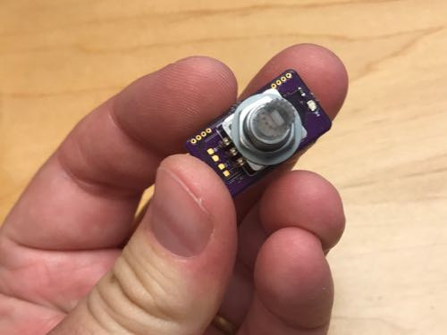
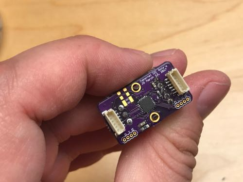

## GM1203 - Illuminated LED Button Panel
This is a daisy-chainable set of buttons. It uses a high-efficiency polling interface to only use the I2C bus when the buttons have been pressed. No soldering is required - the network and power are all provided over the 6-pin connectors. Any number of Knobs can be added to the project and each will receive its own bus address by the master.

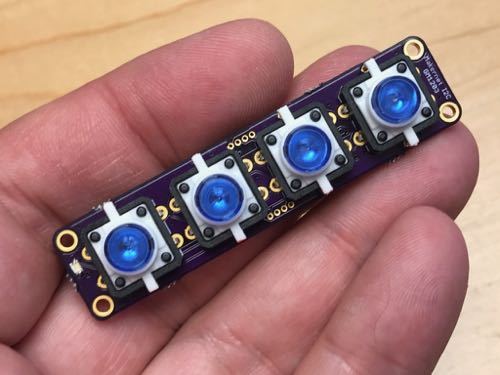
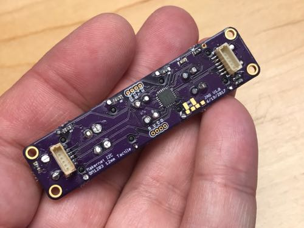

## GM1303 - Illuminated LED Button Panel
This is a ring of 24 little RGB addressable LEDs that let you make a dial interface. (The hole allows you to mount a GM1200 Knob inside!) There is no need to interface the LEDs directly. A small chip on the board translates your I2C commands and controls the LEDs for you. No soldering is required - the network and power are all provided over the 6-pin connectors. Any number of these buttons can be added to the project and each will receive its own bus address by the master.

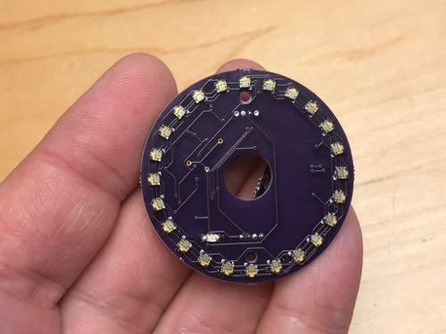
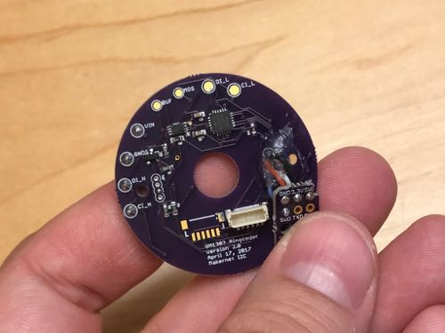

## GM1400 - Illuminated LED Button Panel
This is a SSD1306 OLED with 128x64 pixels measuring about 1.3". The project communicates using a high level graphics protocol for drawing text and graphics. The actual rendering is done on a 48 Mhrz 32-bit ARM processor, offloading effort from the main project MCU. No soldering is required - the network and power are all provided over the 6-pin connectors. 

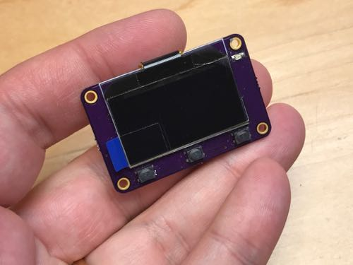
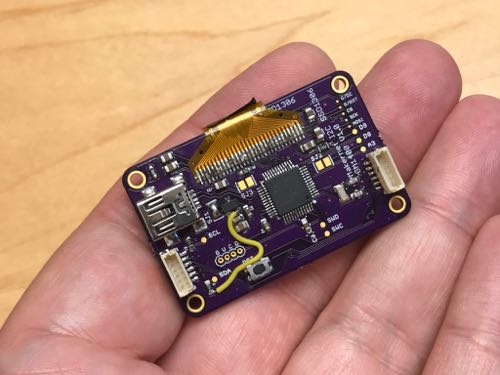

## GM1501 - SAMD21 Mainboard
This is a Arduino-compatible 32-bit ARM processor that is intended to serve as the "main" processor for your project. This is where you'll load your code. It has two 6-pin Makernet connectors that let you connect other Makernet devices without soldering.

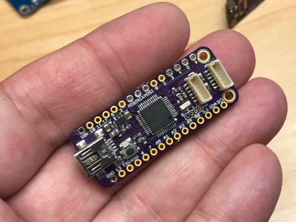
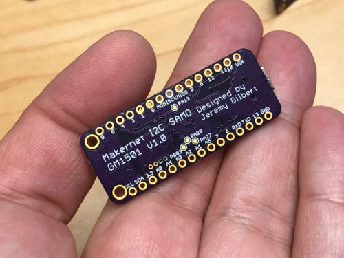

## GM1601 - SAMD21 Mainboard with RFM69 Radio
This is a Arduino-compatible 32-bit ARM processor that is intended to serve as the "main" processor for your project. It also has an embedded packet radio that allows you to extend and bridge the Makernet network over a wireless connection. It has two 6-pin Makernet connectors that let you connect other Makernet devices without soldering.

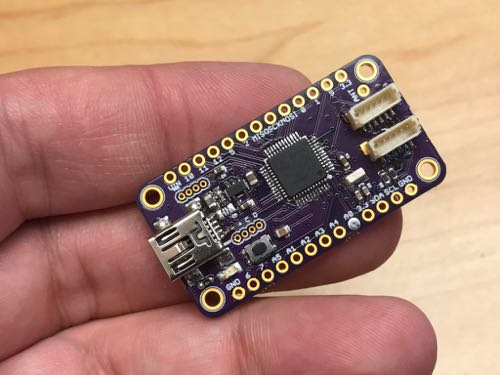
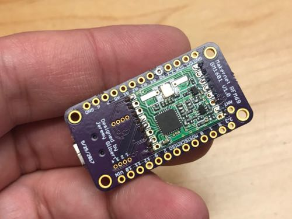

# Makernet networking

Makernet supports a variety of transport layers, but the most common one is based on the I2C specification. Makernet's technical design has been shown to be compatible with RS485 and other more robust signaling frameworks and also offers the ability to bridge multiple networking layers at once. Datalink layers in Makernet are actually pluggable code modules with strong design contracts, therefore swapping out I2C with another transmission medium will not disrupt the higher layers.

What follows is a tour of the "default" makernet construct which uses I2C. 

# Makernet specification: Physical layer (OSI 1)

The physical layer of Makernet is a 6-pin JST-SH header. (Digikey part number XXXX. Add photo)

The six pins are mapped as follows

1. GND (project-wide ground)
2. 3.3V (regulated voltage)
3. VIN (unregulated battery supply between 3.3-5V, often supplied by a battery or USB connection
4. Signal (used for interrupts)
5. SCL - An I2C compatable clock line with V(high) = 3.3V and 4.7K pull ups
6. SDA - An I2C compatable address line with V(high) = 3.3V and 4.7K pull ups

Makernet peripherals designed so far use the JST-SH header for maximum hobbiest flexibility, but technically there is nothing special about this six-wire format. It is perfectly acceptable to simply connect SCL and SDA between devices and let each of them handle their own power requirements. This is a commonly tested use case and should not present any problems as long as the pull-ups resistors are sufficient on both ends.

## Hardware design rational: Connector

Many different connectors ranging from Molex, JST and others were evaluated. JST-SH was deemed best because it is compact, secure, and easily manipulated by hand by both adults and children. My 4 year old daughter had no problem plugging and unplugging Makernet connectors. The next size up from SH/SR is GH, which offers the advantage of having a latch, but is actually harder to insert and remove if the connectors are close together. Going up even larger would involve use of JST-PH, which is substantially larger and would consume more board space.

Also noteworthy is that the 6-wire JST-SR/SH connectors are commonly used in the hobbiest world for GPS serial connections.

## Hardware design rationale: VIN vs. 3.3V

The presense of two different power lanes could be considered a somewhat controversial design choice since it consumes an extra pin on the connector. However, in my experimentation, having a two-lane separation solves a number of key problems. First, is that nearly all sensors and ARM chips are 3.3V devices. Having a selectable V(high) would only support a few use cases interfacing with 5V boards, but having intrinsic 3.3V/5.0V support on every Makernet device would add about 6-8 SMT parts for level shifting and 3.3V regulation. In cases where a 5V MCU is targeted, it is trivial to design a simple breakout board that sits between the Makernet bus and the MCU and will regulate power and provide level shifting to the entire bus at once.

So why have a separate VIN (3.3-5V)? Many of the useful applications of Makernet involve LED lighting, small mechanical interfaces, speakers, and other devies that work best between 4-5V. Rather than each device requiring a boost converter, it seems more logical to have this voltage range provided over the bus cableing.

# Makernet specification: Data-link layer

The data link layer specificies the raw signalling structure of a network stack.

The default data-link layer of Makernet is based around I2C with a few modifications. In an I2C network, masters and slaves communicate in a series of bi-directional transactions over a two-wire interface. The master provides the clock synchronization for the communication, and a set of rules of engagement let other devices know who has "write" authority on the bus. These rules of engagement implement common data-link requirements such as medium-access control (defining who can speak), timing (defining the clock domain for the transfer of information), and link-detection. [TODO For more on I2C, see XXXX, YYYY and ZZZZ.]

I2C is a great choice for a network protocol because it is commonly implemented with hardware peripherals (e.g. in silicon, not software) on a vast number of embedded MCUs including the SAMD21 and SAMD11, which many consider to be the next generation "Arduino" chips. 

Makernet uses I2C with one single, somewhat unusual modification: all nodes use a single I2C address (0x09) rather than each device receiving its own address. This tweak does not interfere in any way with non-Makernet-aware I2C devices such as displays, sound amplifiers, GPIO devices, etc allowing for I2C busses to be mixed between Makernet and non-Makernet I2C devices. Address 0x09 is used because it is reserved for certain types of SMBus peripherals and no commercially available I2C devices will use that address. 

Since all Makernet devices sit on I2C hardware address 0x09, they use the packet structure to provide networking rather than the "hardware" address. This use of I2C falls within the specification.

I2C provides a surprisingly sophisticated medium access control mechanism not unlike RS485 or CANBUS. On initiation of  a message, each sender ("master device") detects if it has control of the clock line. If it doesn't it backs off the transaction allowing the other master to proceed. In most cases this is implemented in silicon as opposed to software.

I2C also supports respose and broadcast arbitration, meaning that multiple responses are generated to a master's message, only one of them will succeed. This functionality is based on something called "dominant/recessive" arbitration. If multiple devices respond to a message, the sending peripherals can discover this situation and the "loosing" device backs off allowing the "winner" to continue the transaction.

Within the C++ framework, Makernet's datalink layers are pluggable and implemented as subclasses of the Datalink class. This allows Makernet to work on more robust physical layer types beyond I2C such as RS485, packet wireless or even Ethernet. Makernet allows for both transactional transports (I2C) and non-transactional links such as RS485. In fact, Makernet was built to allow full stack testing on a emulated data link layer that can be hosted on a OSX or Linux architecture using UNIX-domain sockets.

Note that in Makernet terminology, the groups of bytes that go out on the wire are called "frames". The datalink layer is responsible for taking a bytestream and putting it out on the wire. This means that within the Makernet code, an I2C message is actually a "frame" even though that is not the usual terminology within the I2C specification.

In the I2C world, a slave never transmits a frame unless the master has initiated communication by starting an I2C transaction. Therefore, the master will periodically poll the network for incoming packets by sending a "general call". This general call allows devices the opportuntity to raise their hand and place their packets on the network in the form of "replies" to the master's message.

Other communication layers besides I2C do not have a concept of transactions, and packets are simply sent at will over the network. 

# Network layer

The network layer of Makernet is handled by a custom, minimalist protocol stack that has been carefully designed for low memory and code consumption. This stack handles vending Makernet addresses to peripherals, discovery of new devices, broadcast communication, and introspection. 

The network layer of Makernet is how you actually send and receive packets. 

The basic byte structure of a makernet packet involves a four byte header, the payload, and a checksum

	OFFSET   - Name           - Interpretation
	#00      - destination    - A destination address (0=unassigned, 1=controller, FF=bcast)
	#01      - src            - The source address (0=unassigned, 1=controller, FF=bcast)
	#02      - destPort       - A "port" that can used to further specify the receiving utility inside the destination
	#03      - size           - The size of the payload in bytes (not including checksum)
	#04 - N  - payload        - a payload
	N+1      - checksum       - A crc8 checksum (often implemented as crc8_ccitt_update)

Note that the term packet is used at the network layer of the code and the overall Makernet specification. Once the packet actually goes out onto the wire, it is known using traditional terminology as a "frame". In the case of the I2C data link, the frame will include a destination address (which is always 0x09 and the read/write flag, plus the clock stretching handshakes.) These extra details and information are not exposed up to the networking layer. By the time networking code receives a message, it will have been converted into a packet with that byte format, regardless of how it was transmitted to the device. The reason for this artificial-sounding split between packet and frame is that Makernet is intended to support frames over other protocols besides I2C, such as the RFM69 packet network or RS485 (a multi-drop asychnronous half-duplex serial protocol). Prototype builds of Makernet hardware have confirmed that the Makernet generic packet format is workable across a wide range of communication disciplines and formats.

Within the networking layer there are several "roles"

- Controller: This is typically the host MCU that coordiantes the entire bus. The controller always has a Makernet address of 1.
- Peripheral: This is one of the devices on the network. If an address has been assigned, a peripheral will occupy an address between 02-FE. If it has not yet been assigned, it will use an addresss of 0 (unassigned.)

The destination "port" is an optional value used to route the message to the correct subsystem on the master controller or peripheral. Peripherals are free to use any port numbers between 0x20-0xF0 for any purpose they want. Port numbers of zero are consitently used for all device control messages and framework messages.

# Address assignment

Address assignment is a key step in the Makernet network since at power-on time (or reset time), devices will typically not have assigned addresses. Devices other than the controller begin with an unassigned address 0x00. 

The following describes the orchestration, assuming a transaction-based datalink layer like I2C.

First, the master periodically sends out a `DCS_GENERAL_POLL` request as follows:

	OFFSET   - Name           - Value             - Interpretation
	#00      - destination    - 0xFF	          - Broadcast
	#01      - src            - 0x01	          - The controller
	#02      - destPort       - 0x00              - Port 0 reserved for device control messages
	#03      - size           - 0x01	          - Size
	#04      - payload[0]     - DCS_GENERAL_POLL  - The DCS command
	#05      - checksum       - CCITT_CRC8        - The entire message checksum (#00 to N-1)

Devices that are seeking addresses can respond to this message with a address request packet. This packet describes the type of the device and provides a 16-bit hardware ID. The hardware ID should act like a Ethernet MAC address - it should not be routintely possible for two different devices to have the same hardware ID. In the Makernet implementation for SAMD11 and SAMD21 MCUs, the 32-bit factory hardcoded device serial number is hashed to form the 16-bit ID.

`DCS_REQUEST_ADDRESS` address request packets look like this:

	OFFSET   - Name           - Value             - Interpretation
	#00      - destination    - 0x01	          - The controller
	#01      - src            - 0x00	          - The unassigned address
	#02      - destPort       - 0x00              - Port 0 reserved for device control messages
	#03      - size           - 0x04	          - Size
	#04      - payload[0]     - DCS_REQUEST_ADDRESS  - The DCS command
	#05      - deviceType     - 0x00-0xFF         - A type code indicating the sort of device we are
	#06      - hardwareH      - <any>             - The 8 high order bits of the unique hardware ID
	#07      - hardwareL      - <any>             - The 8 low order bits of the unique hardware ID
	#08      - checksum

Typically, the controller device will examine the address request packet. If it appears to be valid, it may send back an address assignment message (`DCS_ASSIGN_ADDRESS`).

	OFFSET   - Name           - Value             - Interpretation
	#00      - destination    - 0xFF	          - Broadcast
	#01      - src            - 0x01	          - The controller
	#02      - destPort       - 0x00              - Port 0 reserved for device control messages
	#03      - size           - 0x04	          - Size
	#04      - payload[0]     - DCS_ASSIGN_ADDRESS  - The DCS command
	#06      - hardwareH      - <any>             - The 8 high order bits of the unique hardware ID
	#07      - hardwareL      - <any>             - The 8 low order bits of the unique hardware ID
	#08	     - generation     - reserved	      - reserved for future use
	#09		 - address        - 0x02 - 0xFE       - The new address to use
	#08      - checksum

At this point, the peripheral should now begin using the assigned address provided in `address` for all further communication.

# Other internetworking features

Makernet does not require any additional packet types or housekeeping messages beyond those described above for address assignment. All other communication between controllers and peripherals is up to the specific peripheral type (as defined by the DCS above.) 

# Simple example: Hello World

The following is a "hello world" where a bank of LEDs is blinked when a user presses a button. It uses three modules:

- A ATSAMD21 controller board (GMxxxx)
- A DPad button controller (GMxxxx)
- A LED strip (GMxxxx)

Physically it looks like this:

The network diagram created by these components:

An a video demo of what it looks like:

The source code

# Getting started

To get started you must do the following:

1. Install the Arduino IDE
2. Install the Makernet library in your Arduino IDE 
3. Purchase or build a Makernet controller and peripherals and some JST-SH cables
4. String together the components and write some software
